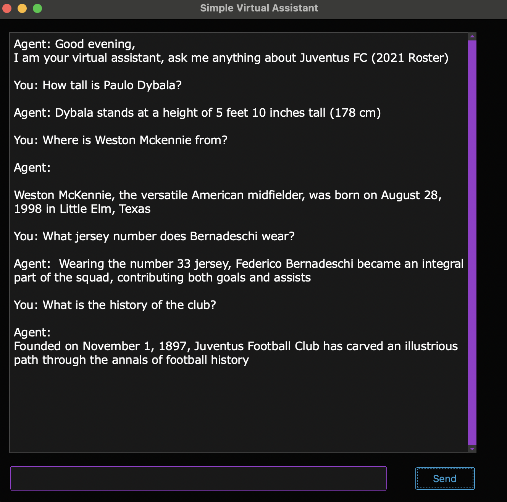

# Juventus-AI-Chatbot
A parternship project in which we built a Chatbot that strives to be exteremely intelligent on a very specific topic. This topic is limited to the 2021 roster of the Juventus FC soccer team. It can answer questions about the players and overall club information and history. It adds user-inputted statements to its database, allowing it to learn from the user. When asked a question, it utilizes 7 AI implmentation techniques to mimic human-like conversation skills. 
These are the 9 implementations:
- Greets the interactor based on the time of day
- Handles repeat questions
- Understands typos
- Recognizes synonyms
- Handles questions about non-related topics
- Handles contradictory information
- Reciprocates politeness when the interactor uses polite language
- Relates pronouns to the subject of the previous question
- Displays Chat-GPT like animation when loading up the answer to a question

We used libraries such as nltk and spacy to try and undesratsnd the composition of sentences and manipulate them to our needs. We used tf-idf calculations to generate keywords from sentences and search our database with them. While this bot has pending imrovements to be done regarding accuracy, I am proud of our independent approach.

This code is viewable for reference only and cannot be copied, modified, or redistributed without explicit permission.

